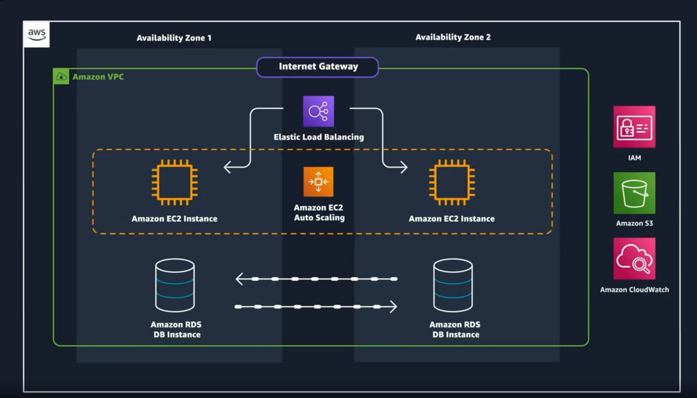
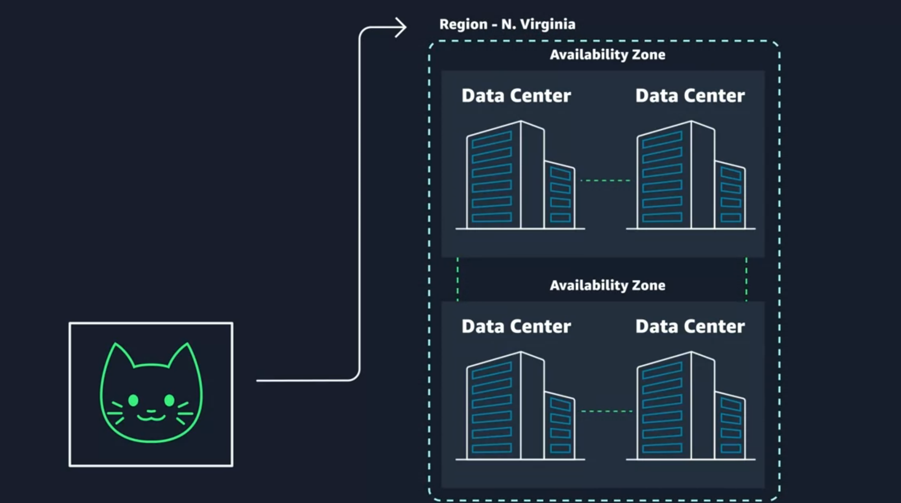

# amazonAWSCertification
Introduction:
We will use a web application that registers new employees. We will use all the services below:
 - VPC for the build;
 - EC2 (essentially provides virtual machines) where we will host the backend;
 - RDS: we will use the non-relational database to store employee data;
 - S3 (Simple Storage Service): where images will be stored;
 - Amazon CloudWatch: will handle application monitoring;
 - Elastic Load Balancing and EC2 Auto Scaling will make the application scalable and fault tolerant;
 - IAM: security and identity;

And for this, we will use the AWS Management Console.

Redundancy: If I store data on my laptop and it burns out, I lose the data. So I store it in the cloud, but what if a natural disaster happens in the data center where my data was? For this, we have the concept of redundancy. My data is replicated in another data center. This data center cluster is called an Availability Zone: where we have redundancy of power, networking, and connectivity. In addition, they cluster Availability Zones together.

How do I know which region I should choose?

Considerations:
- Compliance: check if there is any regulation that requires your DB and/or resources to run within a specific country/location;
- Latency: how close are my resources to my users? You can choose to use Brazil, but users in Oregon will be affected
- Pricing: in São Paulo, for example, it is more expensive due to the tax structure
- Service availability: when a service is launched, it is not applied worldwide at once, but first in your zone

The four points above are basic. We also need to think about Edge locations and regional Edge caches: replicate copies of content so that each request does not have to download it again.

How to interact with the AWS API:
- AWS Management Console
- AWS Command Line Interface
- AWS Software Development Kits

<h1>Security and the AWS Shared Responsibility Model</h1>

The application is composed of parts, and so is the responsibility. Some parts are the responsibility of AWS and others of the customer.

Apply MFA to the root user, but we will avoid using it since there are few actions that require the root account.

Authentication: login
Authorization: which resource and/or service you can use.

<h1>AWS Identity and Access Management</h1>

How will users access our application directly?
We can require the person to have a login and password: this is access management on the app level. And then there is the fact that we know the code running on the VM hosted by EC2, and this code will need to make API calls to the Amazon S3 object storage service to read and write employee data, such as their photos. Just because EC2 and S3 are services in the same account does not mean that API calls between them connect automatically. These accesses need to be authenticated and authorized.

<h2>IAM - Identity and Access Management:</h2>

Gives us access at the AWS account level (login to AWS) and also allows connection for API calls between EC2 and S3. This makes sense because I want the managers of the Açaí application to only make API calls and not touch the source code, and vice versa: if I hire a consultant to analyze the software, I don't want them to have access to my clients'/employees' data.

In IAM:
 - I create logins so people can access the resources of this Amazon AWS account (authentication);
 - and I create the action permissions that each login will have within the platform (authorization): "Does this user have authorization to create an EC2 instance?"

This "action" refers to API calls. Within AWS, everything is an API call.

<h2>IAM Policies</h2>

These are JSON-based documents that contain permissions related to a resource.
"*": allows all actions (API calls) related to EC2;

Action: Defines which specific operations can be performed. For example, s3:GetObject allows getting an object from Amazon S3.

Resource: Defines the resources on which the action can be performed. For example, a specific Amazon S3 bucket (arn:aws:s3:::bucket-name/*).

Best practices:

- Organize users into groups and assign permissions. All users in a group will inherit the permissions;
- Create the account and configure the root with MFA, then create a user with administrator permissions (do not use the root for daily tasks) and log in with it to start creating users, IAM policies, etc.;

<h1>IAM Roles</h1>

When something/someone needs temporary access to AWS, it is very common to allow API calls between services in the AWS account and also because any HTTP call to the AWS account will need a "signature".

To create a Role, just access IAM, look for the app (S3, EC2, etc.) you want to provide access to and the type of permission (read only, read and write, etc.). This access will be temporary, programmatic, and rotational.

Another entity that can assume an IAM role is an <i>External identity provider.</i>

<h1>Changed course to Prep Exam Practitioner</h1>

Domain 1: Cloud concepts

TCO - Total Cost of Ownership:
- Opex (Operational expenses): day-to-day costs to your organization (e.g., printer toner, website hosting, utilities)
- Capex (Capital Expenses): long-term investments (e.g., purchasing a building, servers, your printer – generally purchased once)
- Labor cost associated with on-premises operations: people
- Impact of software licensing costs: the software that I have in my company does not work in the cloud; or I need to pay more for it to work.

Others:

  

