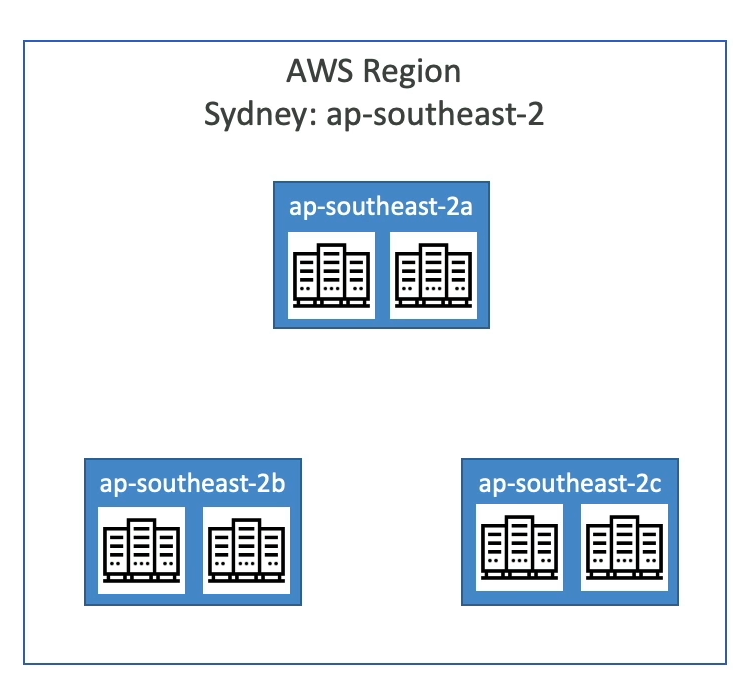

## Global infrastruture

See more: https://aws.amazon.com/pt/about-aws/global-infrastructure/?p=ngi&loc=1

### 1. Regions

Physical location in the world where we have data centers. Each region is completely isolated and independent of the others. Each region has multiple AZs (Availability Zones).

#### How to choose an AWS Region?

- **Compliance:** Some laws require that data from citizens of a country or bloc (such as the European Union) be stored and processed within that region to ensure privacy and protection. For example, GDPR in Europe requires companies to keep European data on servers that follow local rules. Therefore, choosing the right AWS region is essential to meet these legal requirements and avoid fines.
- **Latency:** proximity to reduce the time;
- **Availability services:** new services/features are not available in every Region;
- **Pricing:** pricing varies - impact on an applicantion in others regions

### 1.1.  AZs
One or more discrete data centers with redundant power, networking, and connectivity in an AWS Region. They are physically separated by a meaningful distance, many kilometers, from any other AZ, although all are within 100 km of each other. This is to reduce the risk of a single event impacting availability. Each AZ has multiple data centers.   

- The AZs are  connected logically and separeted phisically - isolated from desasters;

### 1.2. Edge Locations

Data centers that are part of the AWS content delivery network (CDN) called Amazon CloudFront. They are located in major cities around the world and are used to deliver content to end users with lower latency. There are more edge locations than regions and AZs.
