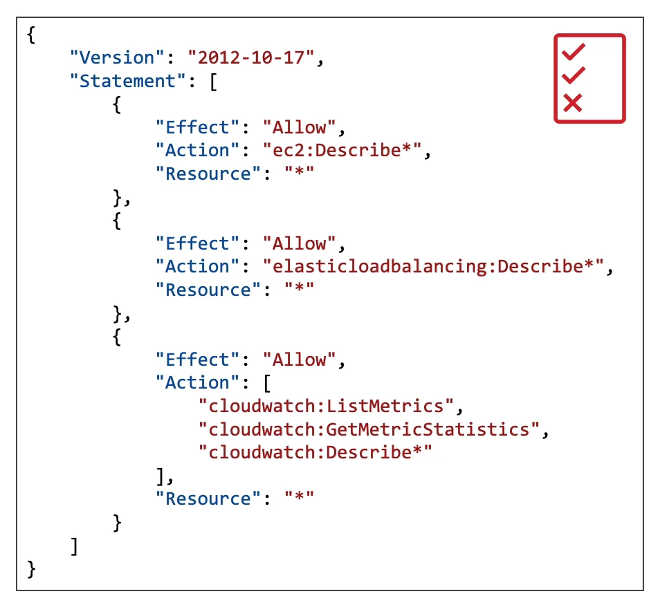

## IAM Permissions

To give people controlled access to cloud services and resources, we use IAM. IAM is an AWS service where we create users, group them (for example, developers, operations, audit, etc.), and create access policies. These policies are JSON documents attached to the groups that users are part of.

### Here is an example of a policy 

An IAM Policy has three main parts:

- **Effect:** allows or denies the action.
- **Action:** what can be done (e.g., view EC2 information).
- **Resource:** the resources the action applies to (e.g., a specific EC2 or all EC2s).

_If "Resource" is **"*"**, the action applies to all resources of that type. If it is an **ARN**, it applies only to that specific resource.

>It is best practice to assign policies to groups rather than directly to users. Besides making permission management easier, this follows the **principle of least privilege**.

 
