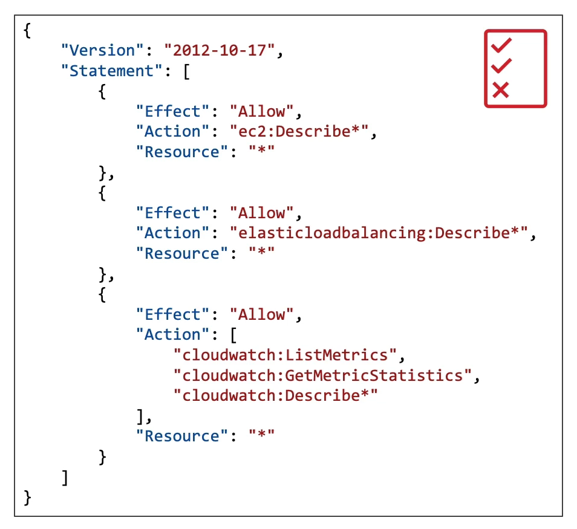
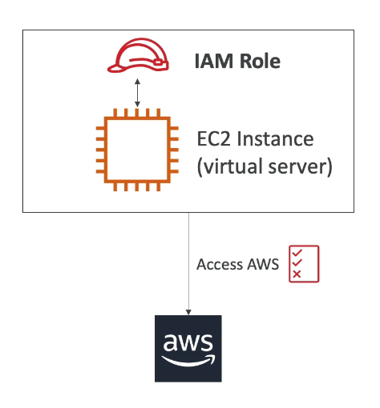

## IAM Permissions

To give people controlled access to cloud services and resources, we use IAM. IAM is an AWS service where you create users, organize them into groups (such as developers, operations, audit, etc.), and attach access policies. These policies are JSON documents linked to groups that users belong to.

### Example of a Policy

An IAM Policy has three main parts:

- **Effect:** allows or denies the action.
- **Action:** what can be done (e.g., view EC2 information).
- **Resource:** the resources the action applies to (e.g., a specific EC2 or all EC2s).

_If "Resource" is **"*"**, the action applies to all resources of that type. If it is an **ARN**, it applies only to that specific resource._




> It is best practice to assign policies to groups rather than directly to users. This makes permission management easier and follows the **principle of least privilege**.

## How to Access AWS

- **AWS Console:** via password + MFA
- **Command Line Interface (CLI):** via Access Key. The CLI lets you run scripts and access AWS public APIs. Access keys are generated in the AWS Console and must be configured for CLI use.

```bash
aws configure
aws s3 ls
aws ec2 describe-instances
```

- **Software Development Kit (SDK):** libraries for programming languages (e.g., boto3 for Python). AWS also provides Mobile SDKs (Android, iOS) and IoT Device SDKs (Embedded, Arduino, etc.).

## IAM Roles

Some services need to perform actions on your behalf. For this, they use roles. Roles are not users.



## IAM Security Tools

- **IAM Credential Report** (account-level): Provides a list of all users and the status of their credentials.
- **IAM Access Report** (formerly Access Advisor, user-level): Shows which service permissions are granted to a user and the last time those services were accessed. In the current AWS Console, this feature may appear as "Access Report" instead of "Access Advisor".

## IAM Best Practices

- Do not use the root account for daily tasks
- Use MFA
- One physical person = one AWS user
- Use roles to grant permissions to services
- Use access keys for programmatic access (CLI/SDK)

## Shared Responsibility Model

- **Security of the Cloud:** AWS is responsible for the security **OF** the physical infrastructure (datacenters, hardware, networks).
- **Security in the Cloud:** The customer is responsible for security **IN** the cloud. This includes protecting access credentials, keeping operating systems and software updated, and following best practices when using services. If there is a password leak or a failure due to lack of updates, the responsibility is the customer's.

## Cloud Service Models: IaaS, PaaS, and SaaS

In AWS (and other clouds), there are different service models:

- **IaaS (Infrastructure as a Service):** You manage servers, storage, and networks, while AWS manages the physical infrastructure. Example: EC2
- **PaaS (Platform as a Service):** You manage only the applications, while AWS manages the OS, middleware, and infrastructure. Example: Elastic Beanstalk
- **SaaS (Software as a Service):** You just use the software, without worrying about infrastructure or platform. Example: any service where you just create an account and use it; Netflix, Gmail, GitHub.

Each model presents a different degree of responsibility between the customer and AWS. For more details on how these responsibilities are distributed in each model, see the [Shared Responsibility Model](https://docs.aws.amazon.com/prescriptive-guidance/latest/strategy-accelerating-security-maturity/understanding-the-security-scope.html).
