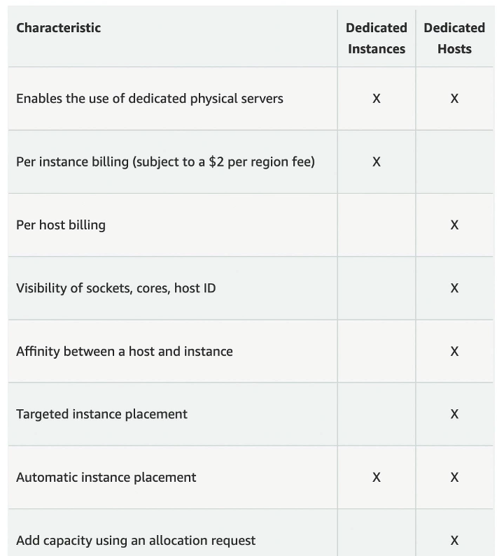

# EC2 Fundamentals 

## EC2 - Elastic Compute Cloud

**EC2s** are AWS's virtual machine service, similar to VirtualBox, but scalable and managed in the cloud.

## Main concepts:

- **AMI (Amazon Machine Image):** The image used to initialize the instance (operating system + configurations).
    - *Image:* A binary file that represents everything stored on the volume of a virtual machine, including the OS and its settings. If you want to replicate an EC2 instance, just create or use its AMI—this ensures all configurations and the environment are copied to the new instance.

- **Instance Type:** Defines CPU, memory, and network performance.
- **Storage:** You can choose network-attached (EBS & EFS) or hardware (EC2 Instance Store).
- **Security Group:** Virtual firewall that controls traffic; you use or create one as needed.
- **Key Pair:** Key used to access the instance via SSH.
- **Bootstrap Script:** Configure at first launch (EC2 user data).

> **Note:** You cannot associate a new key pair after the instance is created.

## EC2 User Data

It is possible to launch commands when a machine starts (bootstrap) the instances using EC2 User Data script. (only run once)

**Example: imagine you have several instances running and need two more. Without bootstrap:**
1. Create new instance;
2. Connect via SSH;
3. Manually install what you need: Node.js, nginx, dependencies, etc.
4. Configure files.
5. Start services and then deploy.

Using User Data at the moment of instance creation, you just pass the script and it is executed as soon as the instance is started.

### EC2 stopped
AWS does not charge for the instance, but charges if there are attached volumes, associated Elastic IP, EBS Snapshots and Load Balancers, if any.

**Note: the public IP will change.**

## [EC2 instances types](https://aws.amazon.com/ec2/instance-types/)

1. General Purpose: good balance between **Compute - Memory - Networking**

**Naming convention:**
- m5.2xlarge: General Purpose
    - m: instance class
    - 5: generation
    - 2xlarge: size within the instance class (memory, CPU, etc.)

2. Compute Optimized: **CPU-intensive** - scientific modeling, machine learning, dedicated gaming servers

- **Naming convention:** C + something

3. Memory Optimized: **RAM-intensive** - fast performance for workloads that process large data sets in memory

**Naming convention:**
- R + something, X, Z, high memory: Memory Optimized

4. Accelerated Computing: **GPU/specialized chips** - machine learning, HPC, graphics workloads

5. Storage Optimized: **High I/O** - distributed file systems, data warehouses, high-frequency databases

6. HPC Optimized: **Supercomputing** - high performance computing at scale
   - **Naming:** Hpc series

See this website for comparison(price, size, etc): https://instances.vantage.sh/

## Security Groups "firewall" on EC2

- Control how traffic is allowed into or out of EC2 instances;
- They regulated:
    - access ports
    - authorised IP ranges - IPv4 IPv6
    - inbound: from other to the instance
    - out: from the instance to other

- Locked to a region/ VPC combination
- Default: allow all outbound and deny all inbound

### Classic Ports to know
- 22: SSH (Secure Shell) - log into a Linux Instance
- 21: FTP(File Transfer Protocol) - upload files into a file shared
- 22: SFTP(Secure File Transfer Protocol) - upload files using SSH
- 80: HTTP - access unsecures websites
- 443: HTTPS - access secure websites
- 3389: RDP (Remote Desktop Protocol) - log into a Windows instance

## Purchasing Options
- On-demand: short workload, pay by second;**(highest cost**)
- Reserved(1 OR 3 years): 
    - set attibutes and period;
    - can be sell in the REserved Instance MArket Place;
    - long workloads;
    - Convertible Reserved Instances: long workloads with flexible instances (change EC2 type, OS, etc.)
- Savings plans(1 OR 3 years): amount of usage in dollars
- Spot Instances: 
    - cheap, but can lose any time(less reliable);
    - the **most cost-efficient**;
    - useful for workloads that are resilient to failure: data analysis, image processing, any distributed workloads

- Dedicated hosts(you see and manage everything - "You rent the house"):
    - physical server
    - allow you see how many cores and socket you are using(Oracle bills you based on that)
    - On-demand or reserved
    - the **most expensive** option: you actually reserve a physical server; 
- Dedicated Instances:
    - hardware dedicated, but with no visibility and management - "You rent the bedroom private"

- Capacity Reservations:
    - Reserve on-demand
    - no time commitment
    - charged no matter if you use it or not;

## Cost Control and Alerts

- **AWS Free Tier:** AWS offers a Free Tier with monthly limits for many services for a certain period. Be careful not to exceed these limits.

> It is **the customer's responsibility** to keep track of service changes. Recently, in July 2025, AWS changed some policies regarding the [Free Tier](https://aws.amazon.com/pt/free/terms/). From that date, if you create an account via IAM Identity Center, you will be directed to Organizations, which is designed for companies on a paid account model—the side effect is losing Free Tier benefits. To use an individual account and enjoy Free Tier benefits, you must create the user via regular IAM.

- **Billing Dashboard:** In the AWS Console, access the Billing Dashboard to view current spending, billing history, and details by service.

- **Budgets:** You can create budget alerts to be notified by email when you reach a certain spending amount.

- **Cost Explorer:** A visual tool to analyze and understand where your main costs are.

- **Usage Alerts:** Set up alerts to be notified when you are close to reaching the Free Tier limit or a defined budget.

- **Tip:** Always terminate resources you are not using, such as EC2 instances, EBS volumes, and S3 buckets, to avoid unnecessary charges.

