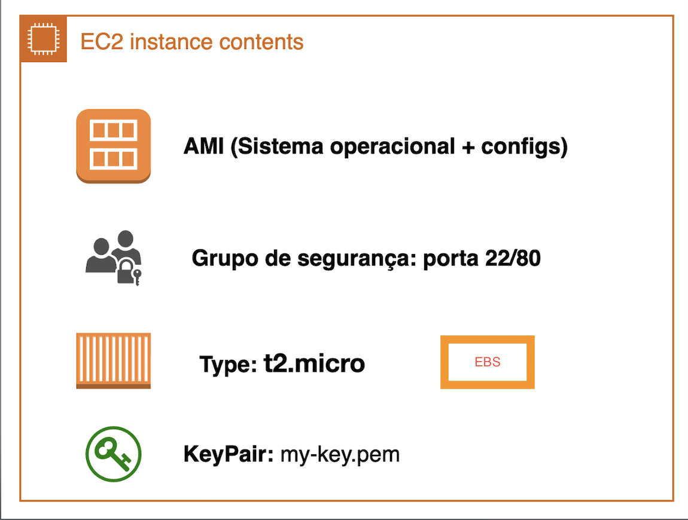

## Cost Control and Alerts

- **AWS Free Tier:** AWS offers a Free Tier with monthly limits for many services for a certain period. Be careful not to exceed these limits.

> It is **the customer's responsibility** to keep track of service changes. Recently, in July 2025, AWS changed some policies regarding the [Free Tier](https://aws.amazon.com/pt/free/terms/). From that date, if you create an account via IAM Identity Center, you will be directed to Organizations, which is designed for companies on a paid account model—the side effect is losing Free Tier benefits. To use an individual account and enjoy Free Tier benefits, you must create the user via regular IAM.

- **Billing Dashboard:** In the AWS Console, access the Billing Dashboard to view current spending, billing history, and details by service.

- **Budgets:** You can create budget alerts to be notified by email when you reach a certain spending amount.

- **Cost Explorer:** A visual tool to analyze and understand where your main costs are.

- **Usage Alerts:** Set up alerts to be notified when you are close to reaching the Free Tier limit or a defined budget.

- **Tip:** Always terminate resources you are not using, such as EC2 instances, EBS volumes, and S3 buckets, to avoid unnecessary charges.

## EC2 - Elastic Compute Cloud

**EC2 (Elastic Compute Cloud)** is AWS's virtual machine service, similar to VirtualBox, but scalable and managed in the cloud.

## Main concepts:

- **AMI (Amazon Machine Image):** image used to initialize the instance (operating system + configs).

        * **Image:** a binary file that represents everything stored on the volume of a virtual machine, including the OS and its settings. If you want to replicate an EC2 instance, just create or use its AMI—this ensures all configurations and the environment are copied to the new instance.
        
- **Instance Type:** defines CPU/memory resources.
- **Security Group:** virtual firewall that controls traffic—you use or create one as needed.
- **Key Pair:** key used to access the instance via SSH.
        
> **Note:** You cannot associate a new key pair after the instance is created.

These are the main components of an EC2 instance: VM CPU and memory, AMI (image), security groups that define inbound and outbound traffic, and key pair for SSH access.

