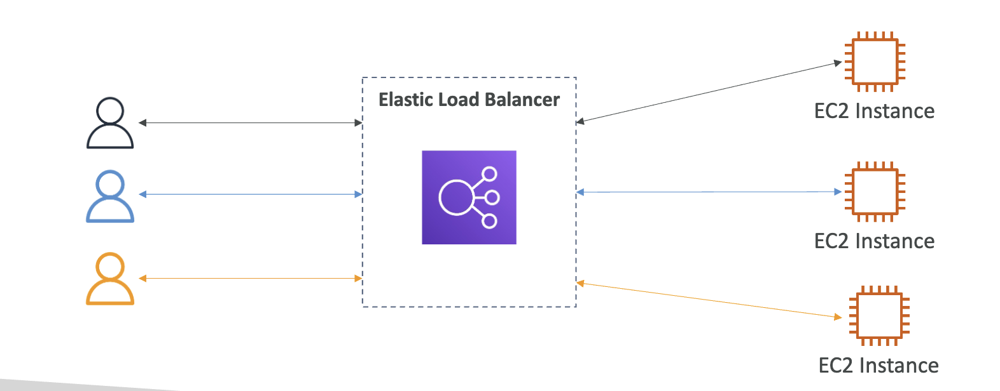

# AWS Fundamentals - ELB and ASG

## Load Balancing

Load balancers are servers that forward traffic to multiple servers.

## ELB (Elastic Load Balancing)

- **Types:**
  - **ALB (Layer 7 HTTP/HTTPS):** Host/path routing, headers, WebSocket/HTTP2/gRPC, integrates with WAF & Cognito/OIDC auth.
  - **NLB (Layer 4 TCP/UDP/TLS):** Ultra-high throughput/low latency, static IP/Elastic IP, preserves source IP.
  - **GWLB (Layer 3):** For network/security appliances (firewalls, IDS), uses GENEVE.
- **Core pieces:** Listeners (ports/protocols) → Rules → Target Groups (instance, IP; ALB also supports Lambda).
- **Health checks** per target group (HTTP/HTTPS/TCP); deregistration delay = connection draining.
- **Stickiness:** ALB cookies when session affinity is required.
- **Cross-Zone LB:** ALB enabled by default; NLB can be enabled (inter-AZ data charges may apply).
- **TLS:** SNI for multiple certificates; store certificates in ACM.
- **Logging/metrics:** Access logs + CloudWatch metrics.

## ASG (Auto Scaling Groups)

- Group of EC2 instances with Desired/Min/Max capacity; Multi-AZ by default.
- Uses Launch Template (AMI, instance type, networking, user-data).
- **Health checks:** EC2 and/or ELB; replaces unhealthy instances automatically.
- **Scaling policies:**
  - Target Tracking (e.g., CPU 50%, ALB request count per target).
  - Step Scaling, Scheduled Scaling; Predictive Scaling (optional).
- **Cooldown and warm-up;** Instance Refresh for rolling updates.
- **Lifecycle hooks** (Pending/Terminating) to run custom actions.
- **Mixed Instances & purchase options** (On-Demand + Spot) with allocation strategies.
- **Scale-in protection** to keep critical instances.
- Registers instances into Target Groups for ALB/NLB.

## Exam Tips

- “Multiple EC2 share files” → EFS; “single host high IOPS DB” → EBS (not ELB/ASG).
- Stateless apps behind ALB + ASG scale well; if stateful, use sticky sessions or externalize state (DB/Redis/EFS).
- To shift traffic between versions: ALB weighted target groups or two target groups with rules.

## Quiz

1. Scaling an EC2 instance from r4.large to r4.4xlarge is called:
   - a. Horizontal Scalability
   - b. Vertical Scalability

2. Running an application on an Auto Scaling Group that scales the number of EC2 instances in and out is called:
   - a. Horizontal Scalability
   - b. Vertical Scalability

3. Elastic Load Balancers provide a:
   - a. Static IPv4 we can use in our application
   - b. Static DNS name we can use in our application
   - c. Static IPv6 we can use in our application

   **Answer:** b
   Elastic Load Balancers, especially Application Load Balancers, provide a consistent endpoint for your applications, allowing seamless access even as the underlying infrastructure changes.

4. You are running a website on 10 EC2 instances fronted by an Elastic Load Balancer. Your users are complaining about the fact that the website always asks them to re-authenticate when they are moving between website pages. You are puzzled because it's working just fine on your machine and in the Dev environment with 1 EC2 instance. What could be the reason?
   - a. The Elastic Load Balancer does not have Sticky Sessions enabled
   - b. Your website must have an issue when hosted on multiple EC2 instances
   - c. The EC2 logs out users as they can't see their IP address; instead, they receive the ELB IP address

   **Answer:** a
   Enabling Sticky Sessions ensures that user requests are consistently sent to the same EC2 instance.

5. You are using an Application Load Balancer to distribute traffic to your website hosted on EC2 instances. It turns out that your website only sees traffic coming from private IPv4 addresses, which are in fact your Application Load Balancer's IP addresses. What should you do to get the IP address of clients connected to your website?
   - a. Modify your website's frontend so that users send their IP in every request
   - b. Modify your website's backend to get the client IP address from the X-Forwarded-For header
   - c. Modify your website's backend to get the client IP address from the X-Forwarded-Port header
   - d. Modify your website's backend to get the client IP address from the X-Forwarded-Proto header

   **Answer:** b
   Selecting "Modify your website's backend to get the client IP address from the X-Forwarded-For header" is correct because this header is commonly used in proxy setups to relay the true client IP address, ensuring accurate IP logging and analysis, which is essential for security and user tracking. By implementing this modification, you align with best practices in web development and enhance the reliability of your application's functionalities.

6. You hosted an application on a set of EC2 instances fronted by an Elastic Load Balancer. A week later, users begin complaining that sometimes the application just doesn't work. You investigate the issue and found that some EC2 instances crash from time to time. What should you do to protect users from connecting to the EC2 instances that are crashing?
   - a. Enable ELB Stickiness
   - b. Enable ELB Termination
   - c. Enable ELB Health check
   - d. Enable Cross-Zone Load Balancing

   **Answer:** c
   When you enable ELB Health check, your ELB won't send traffic to unhealthy EC2 instances.

7. You are working as a Solutions Architect for a company and you are required to design an architecture for a high-performance, low-latency application that will receive millions of requests per second. Which type of Elastic Load Balancer should you choose?
   - a. ALB
   - b. CLB
   - c. NLB

   **Answer:** c

8. Application Load Balancers support the following protocols, EXCEPT:
   - a. HTTP
   - b. HTTPS
   - c. WebSocket
   - d. TCP

   **Answer:** d

9. Application Load Balancers can route traffic to different Target Groups based on the following, EXCEPT:
   - a. Hostname
   - b. Client's Location (Geography)
   - c. Request URL path
   - d. Source IP Address

   **Answer:** b
   "Client's Location (Geography)" is correct because Application Load Balancers (ALBs) do not route traffic based on geographical location; they focus on other factors like URL Path, Hostname, and HTTP Headers.

10. Registered targets in a Target Group for an Application Load Balancer can be one of the following, EXCEPT:
    - a. NLB
    - b. Lambda Functions
    - c. Private IP Address
    - d. EC2 Instances

    **Answer:** a
    "Network Load Balancer" is correct because registered targets for an Application Load Balancer can only be Lambda functions, private IP addresses, or EC2 instances, while Network Load Balancers operate at a lower level in the OSI model and are not compatible as targets for ALBs. This distinction helps you understand the different roles and functionalities of load balancers in cloud architecture.

11. For compliance purposes, you would like to expose a fixed static IP address to your end-users so that they can write firewall rules that will be stable and approved by regulators. What type of Elastic Load Balancer would you choose?
    - a. ALB
    - b. NLB
    - c. Classic Load Balancer

    **Answer:** b
    "Network Load Balancer" because it offers a static IP address per Availability Zone (AZ) and allows Elastic IP addresses to be attached, making it compliant with the requirement for stable IPs for firewall rules.

12. You want to create a custom application-based cookie in your Application Load Balancer. Which of the following can you use as a cookie name?
    - a. AWSALBAPP
    - b. AWSALBTG
    - c. APPUSERPC
    - d. AWSALB

    **Answer:** c
    "APPUSERPC," which is correct because it is the only cookie name listed that is not reserved for the AWS Elastic Load Balancer, allowing you to create a custom application-based cookie.

13. You have a Network Load Balancer that distributes traffic across a set of EC2 instances in us-east-1. You have 2 EC2 instances in us-east-1b AZ and 5 EC2 instances in us-east-1e AZ. You have noticed that the CPU utilization is higher in the EC2 instances in us-east-1b AZ. After more investigation, you noticed that the traffic is equally distributed across the two AZs. How would you solve this problem?
    - a. Enable Sticky Sessions
    - b. Enable Cross-Zone Load Balancing
    - c. Enable ELB Health check
    - d. Enable SSL Termination

    **Answer:** b
    "Enable Cross-Zone Load Balancing," you ensure that traffic is evenly distributed across all EC2 instances, regardless of the Availability Zone, addressing the CPU utilization imbalance you've observed in us-east-1b.

14. Which feature in both Application Load Balancers and Network Load Balancers allows you to load multiple SSL certificates on one listener?
    - a. Server Name Indication (SNI)
    - b. TLS Termination
    - c. Host Headers
    - d. SSL Security Policies

    **Answer:** a
    "Server Name Indication (SNI)" because it allows multiple SSL certificates to be hosted on a single listener by providing the client with the hostname it is trying to connect to.

15. You have an Application Load Balancer that is configured to redirect traffic to 3 Target Groups based on the following hostnames: users.example.com, api.external.example.com, and checkout.example.com. You would like to configure HTTPS for each of these hostnames. How do you configure the ALB to make this work?
    - a. Use HTTP to HTTPS redirect rule
    - b. Use SG SSL certificate
    - c. Server Name Indication (SNI)

    **Answer:** c
    "Use Server Name Indication (SNI)" correctly because it allows you to host multiple SSL certificates on a single listener, which is crucial for managing secure connections for various applications on the same load balancer.

16. You have an application hosted on a set of EC2 instances managed by an Auto Scaling Group that you configured both desired and maximum capacity to 3. Also, you have created a CloudWatch Alarm that is configured to scale out your ASG when CPU Utilization reaches 60%. Your application suddenly received huge traffic and is now running at 80% CPU Utilization. What will happen?
    - a. Desired capacity will go up to 4 and the maximum capacity will stay at 3
    - b. Nothing
    - c. Desired capacity will go up to 4 and the maximum capacity will stay at 3

    **Answer:** b
    Nothing: ASG can't go over the maximum capacity.

17. You have an Auto Scaling Group fronted by an Application Load Balancer. You have configured the ASG to use ALB Health Checks, then one EC2 instance has just been reported unhealthy. What will happen to the EC2 instance?
    - a. The ASG will keep the instance running and re-start the application
    - b. The ASG will detach the EC2 instance and leave it running
    - c. The ASG will terminate the EC2 instance

    **Answer:** c
    "The ASG will terminate the EC2 instance" is correct because when an EC2 instance fails the ALB Health Checks configured for the Auto Scaling Group, it is marked unhealthy and consequently terminated.

18. Your boss asked you to scale your Auto Scaling Group based on the number of requests per minute your application makes to your database. What should you do?
    - a. You politely tell him this is impossible
    - b. Create a CloudWatch custom metric then create a CloudWatch Alarm on this metric to scale your ASG
    - c. Enable Detailed Monitoring then create a CloudWatch Alarm to scale your ASG

    **Answer:** b
    Because it's essential for tracking specific application performance, such as requests per minute to a database, which isn't covered by the default metrics. By creating a custom metric and an associated alarm, you can effectively automate scaling based on real-time application demands.

19. An application is deployed with an Application Load Balancer and an Auto Scaling Group. Currently, you manually scale the ASG and you would like to define a Scaling Policy that will ensure the average number of connections to your EC2 instances is around 1000. Which Scaling Policy should you use?
    - a. Simple Scaling Policy
    - b. Step Scaling Policy
    - c. Scheduled Scaling Policy
    - d. Target Tracking Policy

    **Answer:** d
    Correctly because it automatically adjusts the capacity of your Auto Scaling Group to maintain a specific metric, like the average number of connections per instance, around a predefined target—in this case, 1000 connections. This ensures that your application scales efficiently in response to demand.

20. Your application hosted on EC2 instances managed by an Auto Scaling Group suddenly receives a spike in traffic which triggers your ASG to scale out and a new EC2 instance has been launched. The traffic continuously increases but the ASG doesn't launch any new EC2 instances immediately but after 5 minutes. What is a possible cause for this behavior?
    - a. Cooldown period
    - b. Lifecycle hooks
    - c. Target Tracking Policy
    - d. Launch template

    **Answer:** a
    For each ASG, there's a cooldown (300 seconds) after each scaling activity. In this period, the ASG doesn't launch or terminate EC2 instances. This pause allows metrics to stabilize, ensuring that scaling decisions are based on accurate data.